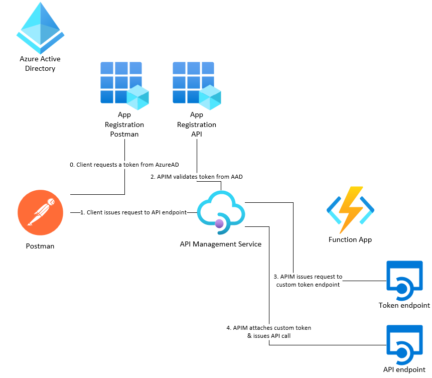
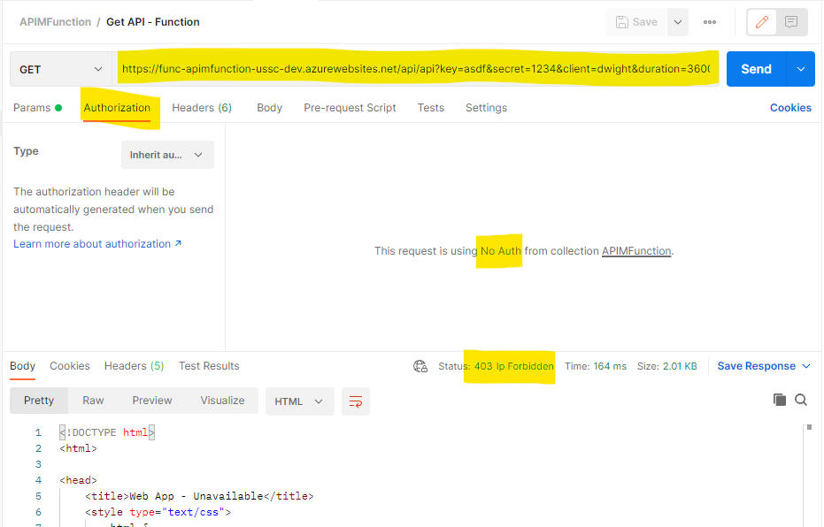
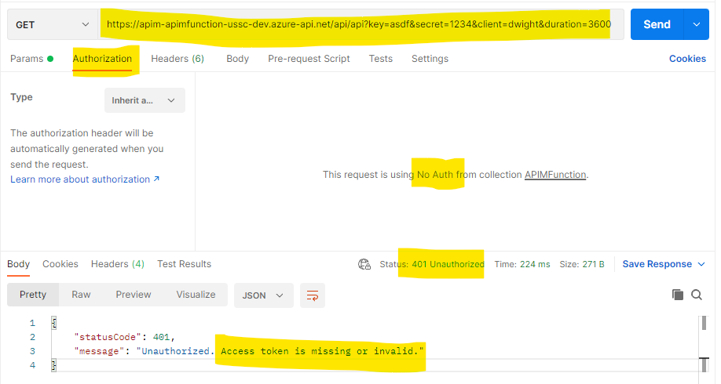
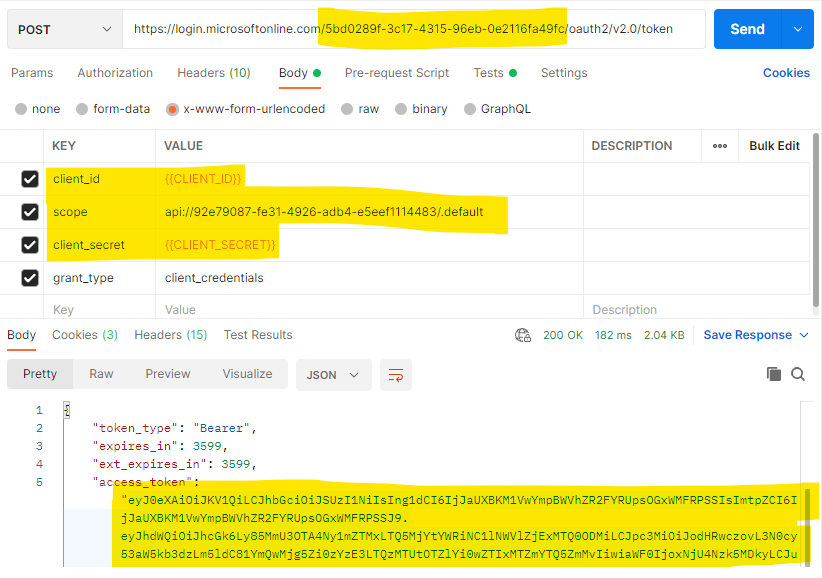
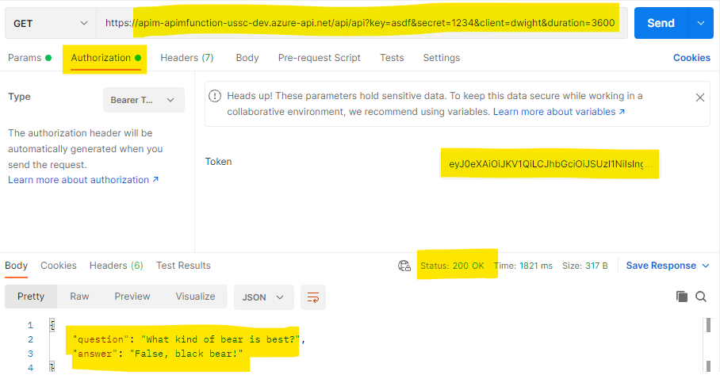

# apim-function

This repo shows you how to call a custom "token" API endpoint programatically as part of an [Azure API Management](https://docs.microsoft.com/en-us/azure/api-management/api-management-key-concepts) policy for a different operation.

In this example, the custom API has a "token" endpoint that is required to call the actual API endpoint. This token endpoint requires some query parameters and returns a custom "token" in the body of the call. This custom token is then passed as the bearer token to the actual API endpoint.

We can use [Azure API Management policies](https://docs.microsoft.com/en-us/azure/api-management/api-management-howto-policies) to call the custom "token" endpoint before allowing the call to reach the actual API endpoint. We will also force Azure AD authentication to the API call by validating the JWT token before allowing the call to continue.



## Azure API Management policies

We need a few API Management policies to do all of the operations we need before the request reaches the actual API endpoint. These can be found in the `/infra/api-management.bicep` file.

### validate-jwt

First, we want to ensure all requests have a valid AAD JWT token before they can then call the API endpoint. We need to validate that they token came from my **AAD tenant** & that the **audience** is for the correct backend AAD service principal.

```xml
<validate-jwt header-name="Authorization" failed-validation-httpcode="401" failed-validation-error-message="Unauthorized. Access token is missing or invalid.">
    <openid-config url="https://login.microsoftonline.com/5bd0289f-3c17-4315-96eb-0e2116fa49fc/.well-known/openid-configuration" />
    <audiences>
        <audience>api://92e79087-fe31-4926-adb4-e5eef1114483</audience>
    </audiences>
    <issuers>
        <issuer>https://sts.windows.net/5bd0289f-3c17-4315-96eb-0e2116fa49fc/</issuer>
    </issuers>
</validate-jwt>
```

### set-variable

Next, we need to store the query parameters that were passed by the initial API call so we can use them later.

```xml
<set-variable name="key" value="@(context.Request.Url.Query["key"].First())" />
<set-variable name="secret" value="@(context.Request.Url.Query["secret"].First())" />
<set-variable name="client" value="@(context.Request.Url.Query["client"].First())" />
<set-variable name="duration" value="@(context.Request.Url.Query["duration"].First())" />
```

### send-request

Next, we are going to send a request to the custom "token" endpoint. We need to pass the query parameters that were set in the previous step.

```xml
<send-request mode="new" response-variable-name="accessToken" timeout="20" ignore-error="true">
    <set-url>@($"https://func-apimfunction-ussc-dev.azurewebsites.net/api/token?key={context.Variables["key"]}&secret={context.Variables["secret"]}&client={context.Variables["client"]}&duration={context.Variables["duration"]}")</set-url>
    <set-method>POST</set-method>
</send-request>
```

Note that the result of the custom "token" endpoint call is a JSON object that is stored in the `accessToken` variable.

```json
{
  "Success": true,
  "Data": {
    "Token": "eyJLZXkiOiJhc2RmIiwiU2VjcmV0IjoiMTIzNCIsIlRva2VuU2VjcmV0IjoiYWJjMTIzIn0="
  },
  "Errors": []
}
```

Obviously, there is nothing super secret in this "token" that we are returning. It contains the same query parameters & a **secret** value that will be checked by the backend API.

### set-header

Now that we have the custom "token" in the `accessToken` variable, we need to set the bearer token as the query parameter for the actual API call.

```xml
<set-header name="Authorization" exists-action="override">
    <value>@($"Bearer {((IResponse)context.Variables["accessToken"]).Body.As<JObject>(preserveContent: true)["Data"]["Token"]}")</value>
</set-header>
```

### set-query-parameter

Finally, we can clear the `key` & `secret` query parameters & use the `client` & `duration` query parameters in our final call the the actual API endpoint.

```xml
<set-query-parameter name="key" exists-action="delete" />
<set-query-parameter name="secret" exists-action="delete" />
<set-query-parameter name="client" exists-action="override">
    <value>@((string)(context.Variables["client"]))</value>
</set-query-parameter>
<set-query-parameter name="duration" exists-action="override">
    <value>@((string)(context.Variables["duration"]))</value>
</set-query-parameter>
```

## Disclaimer

**THE SOFTWARE IS PROVIDED "AS IS", WITHOUT WARRANTY OF ANY KIND, EXPRESS OR IMPLIED, INCLUDING BUT NOT LIMITED TO THE WARRANTIES OF MERCHANTABILITY, FITNESS FOR A PARTICULAR PURPOSE AND NONINFRINGEMENT. IN NO EVENT SHALL THE AUTHORS OR COPYRIGHT HOLDERS BE LIABLE FOR ANY CLAIM, DAMAGES OR OTHER LIABILITY, WHETHER IN AN ACTION OF CONTRACT, TORT OR OTHERWISE, ARISING FROM, OUT OF OR IN CONNECTION WITH THE SOFTWARE OR THE USE OR OTHER DEALINGS IN THE SOFTWARE.**

## Prerequisites

- [Azure CLI](https://docs.microsoft.com/en-us/cli/azure/install-azure-cli)
- [Dotnet CLI](https://docs.microsoft.com/en-us/dotnet/core/tools/)
- [Postman](https://postman.com/)
- Azure subscription & resource group

## Deployment

1.  Create the AAD service principal to be the identity of the backing API.

    1.  Navigate to the [Azure portal](https://portal.azure.com)

    1.  Search for the **Azure Active Directory** service.

    1.  Click on **App Registrations** and click on **New registration**.

    1.  Give it a name & a redirect URI (the redirect URI doesn't really matter since the API won't be authenticating itself in this example).

    1.  On the **Overview** blade, note the **Application (client) ID** and **Directory (tenant) ID**.

    1.  Click on the **Expose an API**

    1.  Set the **Application ID URI** (you can keep the default, which is the application ID of the app registration)

    1.  Click on **Add a scope** and give it a name (example: **API.AccessAsUser**). Set the other fields as appropriate and click **Save**.

1.  Create the AAD service principal to be the identity of calling service (in this example, Postman).

    1.  Click on **App Registrations** and click on **New registration**.

    1.  Give it a name & a redirect URI (you can select **Web** and **https://oauth.pstmn.io/v1/callback** as the redirect URI for Postman).

    1.  Note the On the **Overview** blade, note the **Application (client) ID** and **Directory (tenant) ID**.

    1.  Click on the **API permissions** blade and click on **Add a permission**.

    1.  Select the **My APIs** tab and find the other app registration you created earlier. Select the **scope** you created earlier. Click **Add permissions**.

1.  Grant the calling service access to the API.

    1.  On the original app registration (the one for the API), click on the **Expose an API** blade and then click on **Add a client application**. Add the **application (client) ID** of the **calling** application, select the **Authorized scopes** and click on **Add application**.

1.  Update the `/infra/env/dev.parameters.json` file as needed.

1.  Execute the following Azure CLI command to deploy the infrastructure (change the **email addresses**, **resource group** & **functionAppAADAudience** as needed).

    ```shell
    az deployment group create --resource-group rg-apimFunction-ussc-dev --template-file ./main.bicep --parameters ./env/dev.parameters.json --parameters apiManagementServicePublisherName=apimFunction apiManagementServicePublisherEmail=dwight.k.schrute@dunder-mifflin.com functionAppAADAudience=api://92e79087-fe31-4926-adb4-e5eef1114483
    ```

    The command will output the various endpoints you will call to interact with the deployed infrastructure.

1.  Build & deploy the Azure Function code (modify the name & resource group as needed)

    **NOTE: This example assumes you are on the same network as the Azure Functions (such as with a VPN Gateway or ExpressRoute). The Azure Functions have their inbound traffic routed via private endpoint and are not publically accessible.**

    ```shell
    cd ./src/api
    func azure functionapp publish func-apimFunction-ussc-dev --resource-group rg-apimFunction-ussc-dev
    ```

## Test

1.  First, you can verify that the Azure Function is not publically accessible directly.



1.  Next, verify that APIM will block an unauthenticated request.



1.  Now, request an AzureAD token so you can make authenticated requests. Set the `tenantId`, `client_id`, `scope` & `client_secret` as appropriate.



1.  Finally, call the API endpoint and verify that the data is returned.



## Links

- [Azure API Management](https://docs.microsoft.com/en-us/azure/api-management/overview)
- [Azure API Management policies](https://docs.microsoft.com/en-us/azure/api-management/api-management-howto-policies)
- [Azure API Management policy expressions](https://docs.microsoft.com/en-us/azure/api-management/api-management-policy-expressions)
- [Azure API Management policy reference index](https://docs.microsoft.com/en-us/azure/api-management/api-management-policies)
